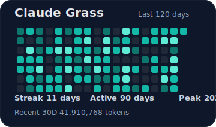
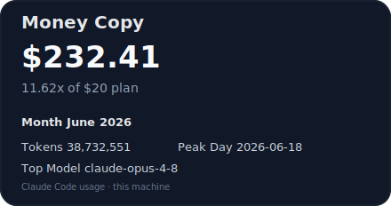
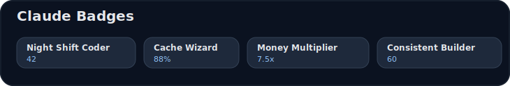

# Claude Grass 🌱

A small local tool that reads your **Claude Code usage** (terminal, IDE, and
desktop sessions) from your own computer and turns it into cards you can show
off on your **GitHub profile**.

- 🟩 A **contribution-style graph** of your daily Claude usage
- 💸 A **"Money Copy" card** — how much API-equivalent value you got this month
- 🏅 **Badges** for your usage habits (night owl, weekend grinder, cache wizard…)
- 📌 Drop the cards straight into your GitHub **profile README**
- 🔒 Runs **100% on your machine** — no server, no account, nothing uploaded by the tool itself

> **Scope:** it reads only *this machine's* Claude Code logs (`~/.claude/projects`)
> — the terminal CLI, the VS Code/JetBrains extension, and desktop-initiated
> sessions. It does **not** see claude.ai web chat (there are no local logs for
> it) or usage from other computers.

## Demo

> Sample cards generated from synthetic data.

**Claude Grass**



**Money Copy Card**



**Claude Badges**



## What you get (3 cards)

| Card | What it shows |
|---|---|
| 🟩 **Claude Grass** | Daily usage as a contribution graph, plus current streak, active days, and peak day |
| 💸 **Money Copy Card** | This month's estimated API-equivalent spend and how many times your plan price you "got back" |
| 🏅 **Claude Badges** | Habit badges from your usage (e.g. Night Shift Coder, Cache Wizard, Money Multiplier) |

It also writes `profile-summary.json` with the raw numbers, including a
**per-surface breakdown** (`cli` / `claude-vscode` / `claude-desktop`).

## How it works

```
~/.claude/projects/*.jsonl   →   SQLite rollups   →   SVG cards + JSON   →   your profile repo
   (Claude Code logs)            (kept forever)        (output/)              (assets/ + README)
```

The key idea: Claude keeps local logs for only about a month, then deletes old
ones. This tool copies each day into its own database **once**, so your history
**survives** even after Claude removes the raw logs.

## Requirements

- **Python 3.9+** (standard library only — no third-party packages)
- **Git** and a **GitHub profile repo**: a repo named exactly like your username
  (e.g. `your-name/your-name`), whose README shows on your profile

> The Python module is `claude_profile_stats` — that's what the commands below use.

## Quick start

### 1. Configure

```bash
cp config.toml.example config.toml
```

Then edit `config.toml` and set your paths (see [Configuration](#configuration)).

### 2. Generate the cards

```bash
python -m claude_profile_stats.app all --config config.toml
# (use python3 on macOS/Linux if `python` isn't found)
```

This reads your logs and writes the cards into `output/`.

### 3. Copy them into your profile repo

```bash
python -m claude_profile_stats.app publish --config config.toml
```

This copies the cards into `<profile_repo>/assets/` and adds a small,
marker-delimited section to that repo's `README.md` — your existing README is
preserved.

### 4. Push

```bash
cd <your profile repo>
git add README.md assets
git commit -m "Add Claude Grass"
git push
```

Refresh your GitHub profile — the cards should appear (image caching can delay
this by a few minutes).

## Updating (manual for now)

There is **no automatic/scheduled sync yet**. To refresh, re-run steps 2–4.

You don't need to run it every day: a single run picks up every day still on
disk. Just run it **at least once within ~a month**, before Claude rotates out
old logs — anything already saved to the database is kept permanently.

## Configuration

`config.toml`:

| Key | Meaning |
|---|---|
| `paths.claude_base` | Your Claude folder (usually `~/.claude`) |
| `paths.profile_repo` | Local clone of your GitHub profile repo |
| `paths.database` | Where rollups are stored (default `./data/profile.db`) |
| `paths.output_dir` | Where cards are written (default `./output`) |
| `profile.github_username` | Your GitHub username |
| `profile.plan_monthly_price_usd` | Your plan price, for the "Money Copy" multiplier |
| `grass.days` | How many days the grass card covers |
| `grass.levels` | Token thresholds for the 4 color intensities |

## Commands

```bash
python -m claude_profile_stats.app sync      # read logs → update rollups
python -m claude_profile_stats.app render    # rollups → SVG cards + JSON
python -m claude_profile_stats.app all       # sync + render
python -m claude_profile_stats.app publish   # copy cards into your profile repo
```

## Development

Run the test suite (standard library, no dependencies):

```bash
python -m unittest discover
```

Regenerate the sample cards in `docs/images/`:

```bash
python scripts/generate_sample_assets.py
```

Design docs live in [`docs/`](docs/) (PRD, TRD, and a step-by-step Korean install guide).

## Contributing

Issues and PRs are welcome — bug reports, card designs, new badges, and themes
especially. This is an early project, so feedback on the output and the
onboarding flow is very useful.

## License

[MIT](LICENSE)
